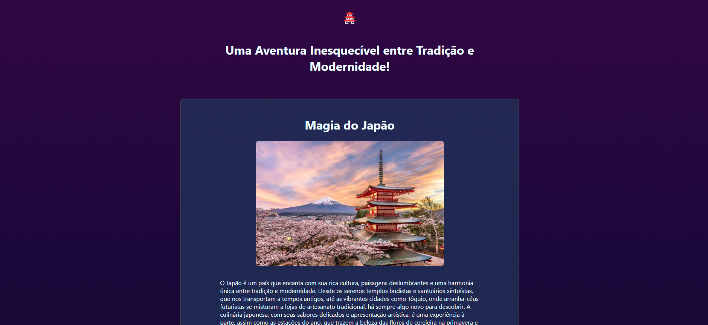

     
 

<h1 align="center">
Projeto: Guia Turístico do Japão
 &#128512;
</h1>

No curso da Rocketseat, tive a oportunidade de desenvolver um projeto incrível: um guia turístico dedicado ao Japão. Este projeto foi uma forma de colocar em prática todo o conhecimento adquirido em HTML e CSS até agora, permitindo que eu explorasse minha criatividade e habilidades técnicas.
 &#128512;

O guia foi projetado para ser uma fonte completa de informações sobre as principais atrações turísticas do Japão, incluindo templos históricos, paisagens deslumbrantes e a rica cultura japonesa. Utilizando HTML, criei a estrutura básica do site, organizando as informações de maneira clara e acessível. Cada seção do guia apresenta detalhes sobre os locais, dicas de viagem e imagens inspiradoras que capturam a essência do Japão.
 &#128512;

